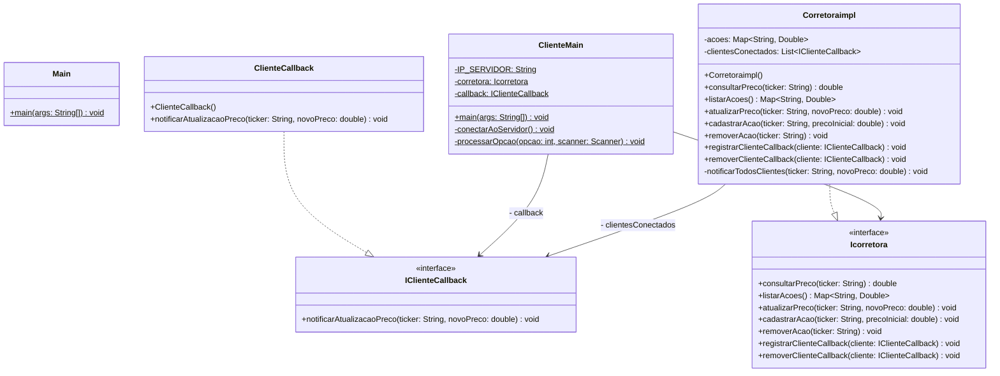

# Teste de Java RMI para sistemas distribuídos.

#Diagrama de classes



Primeiro Fizemos  duas interface uma para definir qual função obrigatória do cliente e funções obrigatória do corretora da corretora sendo
* **Icorretora** = Define as operações remotas do servidor, incluindo:

Consultas: consultarPreco e listarAcoes.

Gestão de Mercado: atualizarPreco, cadastrarAcao e removerAcao.

Callbacks: registrarClienteCallback e removerClienteCallback para notificações em tempo real.

```java
public interface Icorretora extends Remote {
  // Consultas e Operações Básicas
  double consultarPreco(String ticker) throws RemoteException;
  Map<String, Double> listarAcoes() throws RemoteException;
  void atualizarPreco(String ticker, double novoPreco) throws RemoteException;
  void cadastrarAcao(String ticker, double precoInicial) throws RemoteException;
  void removerAcao(String ticker) throws RemoteException;

  // Gerenciamento de Callbacks (Para a notificação em tempo real)
  void registrarClienteCallback(IClienteCallback cliente) throws RemoteException;
  void removerClienteCallback(IClienteCallback cliente) throws RemoteException;
}
````
* **IclienteCallback** = interface que define como o cliente recebe notificações do servidor, através do método notificaratualizacaodepreco, permitindo identificar se o evento é de Cadastro, Atualização ou Remoção de uma ação, além do ticker e do novo preço.

```java
public interface IClienteCallback extends Remote {
  // Agora o servidor avisa o que é: "CADASTRAR", "ATUALIZAR" ou "REMOVER"
  void notificarAtualizacaoPreco(String tipoEvento, String ticker, double novoPreco) throws RemoteException;
}
```

## Classe que implementa logíca do servidor.

* A primeira coisa a ser feita foi transformar a classe em um objeto remoto isso é o que faz a classe ficar visivel na rede, implementar a classe Icorretora.

```java
public class CorretoraImpl extends UnicastRemoteObject implements ICorretora{}

```

* **ConcurrentHashMap** = imagine dois clientes (dois notebooks diferentes) tentando atualizar o preço do Bitcoin (BTC) exatamente no mesmo milissegundo. Se usássemos um **HashMap** normal, a memória do servidor poderia se corromper, e o programa travaria.
````java
private Map<String, Double> acoes; // Inicializado como ConcurrentHashMap
````
 
O ConcurrentHashMap resolve isso gerenciando travas (locks) internamente. Ele permite que dezenas de clientes leiam e atualizem preços ao mesmo tempo, de forma totalmente segura e rápida. 

* **CopyOnWriteArrayList** = Quando o preço muda, o servidor faz um for (loop) nessa lista para avisar todo mundo. Mas e se, bem no meio do loop, um novo cliente se conectar? Ou pior, e se um cliente fechar o notebook e for removido da lista? Em listas normais (**ArrayList**), isso gera um erro fatal chamado **ConcurrentModificationException**, derrubando o servidor.

````java
private List<IClienteCallback> clientesConectados; // Inicializado como CopyOnWriteArrayList
````

A CopyOnWriteArrayList cria uma "cópia" segura da lista toda vez que alguém entra ou sai. Assim, quem está lendo (o loop de notificação) nunca é interrompido por quem está escrevendo (um novo cliente se conectando).

* **Tolerância a Falhas Básica (queda do Cliente).**

  O servidor percorre a lista de clientes conectados para enviar atualizações. Agora, além do ticker e preço, ele envia o tipo do evento (Cadastro, Atualização ou Remoção). Caso um cliente perca a conexão, o RMI dispara uma RemoteException, e o servidor automaticamente o remove da lista para evitar desperdício de recursos.
````java
// Método interno atualizado para receber a String
private void notificarTodosClientes(String tipoEvento, String ticker, double novoPreco) {
  for (IClienteCallback cliente : clientesConectados) {
    try {
      cliente.notificarAtualizacaoPreco(tipoEvento, ticker, novoPreco);
    } catch (RemoteException e) {
      System.err.println("[AVISO] Falha ao notificar cliente. Removendo da lista.");
      clientesConectados.remove(cliente);
    }
  }
}
}
````
O bloco try/catch foi atualizado para lidar com as novas notificações de evento (Cadastro, Atualização e Remoção). Caso o servidor tente enviar um desses eventos e o cliente não responda (por queda de rede ou fechamento do programa), o RMI captura a RemoteException. O servidor então remove esse cliente da lista de notificações silenciosamente, garantindo que o sistema continue rodando sem interrupções para os demais usuários conectados.

## Mudando a logica do main.

Para inicializar corretamente a classe implementada.

````java
public class ServidorMain {
    public static void main(String[] args) {
        try {
            System.setProperty("java.rmi.server.hostname", "192.168.0.10");
            
            ICorretora corretora = new CorretoraImpl();
            
            Registry registry = LocateRegistry.createRegistry(1099);
            
            registry.rebind("ServicoCorretora", corretora);

            System.out.println("[OK] Servidor RMI da Corretora no ar!");
            System.out.println("[INFO] Rodando no IP: " + System.getProperty("java.rmi.server.hostname"));
            System.out.println("[INFO] Aguardando clientes...");

        } catch (Exception e) {
            System.err.println("[ERRO CRÍTICO] O servidor falhou ao iniciar:");
            e.printStackTrace();
        }
    }}
````
### *Pontos de resalvas.*

* **LocateRegistry.createRegistry(1099):** nós fizemos no próprio código Java abrir a porta 1099.
* **rebind("ServicoCorretora", corretora):** Esse é o nome que os clientes vão ter que procurar para achar a sua corretora. Se o cliente procurar por "CorretoraDistribuida", vai dar erro. Tem que ser o nome exato!
* **Controle de IP:** Você precisa abrir o CMD do Windows, digitar ipconfig, pegar o endereço IPv4 do notebook que vai ser o servidor e colar no System.setProperty. Se não fizer isso, os outros notebooks não conectam.

## Agora a parte do cliente.

Para que o cliente seja capaz de receber mensagens do servidor sem precisar solicitá-las, a classe ClienteCallback é transformada em um objeto remoto.

O que ocorre nesta classe:

Processamento de Eventos: A classe utiliza uma estrutura de decisão para identificar a natureza da mensagem enviada pelo servidor.

Alertas Customizados: Dependendo da instrução recebida, o sistema exibe alertas específicos para o usuário:

REMOVER: Informa que um ativo foi retirado do mercado.

CADASTRAR: Notifica a chegada de uma nova ação e seu preço inicial.

ATUALIZAR: Indica uma oscilação no valor de um ativo já existente.

Manutenção da Interface: Após exibir um alerta, a classe garante que o menu de navegação do usuário seja impresso novamente na tela, evitando que as notificações interrompam a usabilidade do terminal.

````java
}public class ClienteCallback extends UnicastRemoteObject implements IClienteCallback {

  public ClienteCallback() throws RemoteException {
    super();
  }

  @Override
  public void notificarAtualizacaoPreco(String tipoEvento, String ticker, double novoPreco) throws RemoteException {
    System.out.println("\n");
    System.out.println("========== NOTIFICAÇÃO EM TEMPO REAL ==========");
    
    switch (tipoEvento) {
      case "REMOVER":
        System.out.println("[ALERTA] Ativo '" + ticker + "' foi REMOVIDO do mercado.");
        break;
      case "CADASTRAR":
        System.out.println("[ALERTA DE MERCADO] O ativo '" + ticker + "' foi CADASTRADO! Preço: " + novoPreco);
        break;
      case "ATUALIZAR":
        System.out.println("[ALERTA DE MERCADO] O ativo '" + ticker + "' MUDOU de preço! Novo valor: " + novoPreco);
        break;
    }

    System.out.println("===============================================");
    
    if (ClienteMain.ultimoPrompt != null && !ClienteMain.ultimoPrompt.isEmpty()) {
      System.out.print(ClienteMain.ultimoPrompt);
    }
  }
}
````

## Menu cliente.

````java
public class ClienteMain {
    
    private static ICorretora corretora;
    private static IClienteCallback callback;
    private static final String IP_SERVIDOR = "192.168.0.10"; // COLOQUE AQUI O MESMO IP DO PASSO 3

    public static void main(String[] args) {
        Scanner scanner = new Scanner(System.in);
        
        // Tenta conectar a primeira vez
        conectarAoServidor();

        int opcao = -1;
        while (opcao != 0) {
            System.out.println("\n--- MENU DA CORRETORA ---");
            System.out.println("1. Consultar preço de uma ação");
            System.out.println("2. Listar todas as ações");
            System.out.println("3. Atualizar preço de uma ação");
            System.out.println("0. Sair");
            System.out.print("Escolha uma opção: ");
            
            try {
                opcao = Integer.parseInt(scanner.nextLine());
                processarOpcao(opcao, scanner);
            } catch (NumberFormatException e) {
                System.out.println("Por favor, digite um número válido.");
            } catch (Exception e) {
                System.err.println("[ERRO] Perda de conexão com o servidor!");
                System.out.println("[SISTEMA] Tentando reconectar...");
                conectarAoServidor(); // <-- TOLERÂNCIA A FALHAS: Tenta reconectar se a chamada falhar
            }
        }
        
        // Ao sair, avisa o servidor para parar de mandar mensagens (boa prática)
        try {
            if (corretora != null) corretora.removerClienteCallback(callback);
            System.out.println("Desconectado com sucesso.");
        } catch (Exception e) {
            // Ignora erro ao fechar se o servidor já estiver fora do ar
        }
        System.exit(0);
    }

    // MÉTODO DE CONEXÃO E RECONEXÃO
    private static void conectarAoServidor() {
        boolean conectado = false;
        while (!conectado) {
            try {
                // Procura o catálogo no IP do servidor, porta 1099
                Registry registry = LocateRegistry.getRegistry(IP_SERVIDOR, 1099);
                corretora = (ICorretora) registry.lookup("ServicoCorretora");
                
                // Cria o callback e avisa o servidor: "Me avise quando mudar algo!"
                if (callback == null) {
                    callback = new ClienteCallbackImpl();
                }
                corretora.registrarClienteCallback(callback);
                
                System.out.println("[OK] Conectado à Corretora com sucesso!");
                conectado = true;
                
            } catch (Exception e) {
                System.err.println("[FALHA] Não foi possível conectar ao servidor. Tentando novamente em 5 segundos...");
                try {
                    Thread.sleep(5000); // Espera 5 segundos antes de tentar de novo
                } catch (InterruptedException ie) { }
            }
        }
    }

    // PROCESSAMENTO DO MENU
    private static void processarOpcao(int opcao, Scanner scanner) throws Exception {
        switch (opcao) {
            case 1:
                System.out.print("Digite o Ticker da ação (ex: BTC): ");
                String ticker = scanner.nextLine();
                double preco = corretora.consultarPreco(ticker);
                if (preco != -1.0) {
                    System.out.println("Preço atual: " + preco);
                } else {
                    System.out.println("Ativo não encontrado.");
                }
                break;
            case 2:
                Map<String, Double> acoes = corretora.listarAcoes();
                System.out.println("--- AÇÕES DISPONÍVEIS ---");
                for (Map.Entry<String, Double> entry : acoes.entrySet()) {
                    System.out.println(entry.getKey() + " -> " + entry.getValue());
                }
                break;
            case 3:
                System.out.print("Digite o Ticker da ação a ser atualizada: ");
                String tickerUpdate = scanner.nextLine();
                System.out.print("Digite o novo preço: ");
                double novoPreco = Double.parseDouble(scanner.nextLine());
                corretora.atualizarPreco(tickerUpdate, novoPreco);
                System.out.println("Preço atualizado com sucesso no servidor!");
                break;
            case 0:
                System.out.println("Saindo...");
                break;
            default:
                System.out.println("Opção inválida.");
        }
    }
}
````
### Pontos do codigo.

* **Transparência de Acesso:** Note que na linha corretora.consultarPreco(), o Cliente chama o método como se a Corretora estivesse na própria máquina dele. Ele não sabe que isso está viajando pela rede.
* **Atualização em tempo real:** Se você abrir dois clientes (duas telas no CMD) e atualizar o preço no Cliente A, o Cliente B vai receber o alerta automaticamente via ClienteCallback.
* **Tolerância a Falhas:** Se ovocê fechar a aba do Servidor enquanto o Cliente está rodando e você tentar consultar um preço, o catch (Exception e) vai pegar o erro e chamar o conectarAoServidor(), que vai ficar tentando se conectar de 5 em 5 segundos até você ligar o servidor de volta!

### Modificações cliente main

Acabamos tendo um problema como queríamos evitar que alguns cliente perca a modificação  de algumas da ações tentamos implementar uma fila de notificações, mas no fim o programa ficava parado esperando a interação do usuário isso logo fazia a notificação ser perdida de qualquer forma com isso em mente deixamos
os avisos em tempo real e salvamos a última string enviado em um espaço de memória para ser reprimida na tela mas isso levava a notificação é reenviada sem necessidade por isso colocamos uma trava para so quando o ultimo prompt for salvo e for diferente de null tivemos que implementa a lógica de zerar a variável todas vez depois de terminado a função

**como ficou a modificação**
 
*no **clientemain***

```java
case 5:
                ultimoPrompt = "Digite o Ticker da ação a ser removida: ";
                System.out.print(ultimoPrompt);
                String tickerRemove = scanner.nextLine();
                ultimoPrompt = "";
```
*no **clientecallback***

também lembrando que implementamos uma listar antes da notificação para assim diferenciar melhor o que cada cliente esta fazendo
criando, modificando ou apagando uma ação.

* **ClienteMain: Interface Inteligente e Resiliência**

A classe ClienteMain gerencia a interface de terminal e a robustez da conexão. O maior desafio resolvido nesta classe foi o Gerenciamento de Fluxo de Interface para lidar com notificações assíncronas (Callbacks).

Destaques do Funcionamento:

Tolerância a Falhas Dinâmica: O método conectarAoServidor() utiliza um loop de tentativa e erro com Thread.sleep(5000). Isso permite que o cliente seja iniciado antes do servidor ou recupere a conexão automaticamente caso o servidor sofra um reinício, sem que o usuário precise fechar o programa.

Gestão de Prompt (UX/UI no Terminal): * O Problema: Em sistemas RMI com Callback, uma notificação pode chegar exatamente enquanto o usuário está digitando um valor, "quebrando" a linha visual do terminal.

A Solução: Utilizamos a variável volatile String ultimoPrompt. Antes de cada entrada de dados (scanner.nextLine()), o prompt atual é salvo. Se uma notificação chegar via ClienteCallback, ela imprime o alerta e, logo em seguida, reimprime o ultimoPrompt.

Sincronização: Após o usuário pressionar "Enter", a variável é zerada (ultimoPrompt = ""), garantindo que alertas futuros não repitam perguntas já respondidas.

Operações Remotas: O cliente encapsula toda a lógica de negócio (Cadastrar, Remover, Atualizar e Listar) através da interface Icorretora, tratando as ações como se fossem locais, mas com tratamento de exceções para falhas de rede.
```